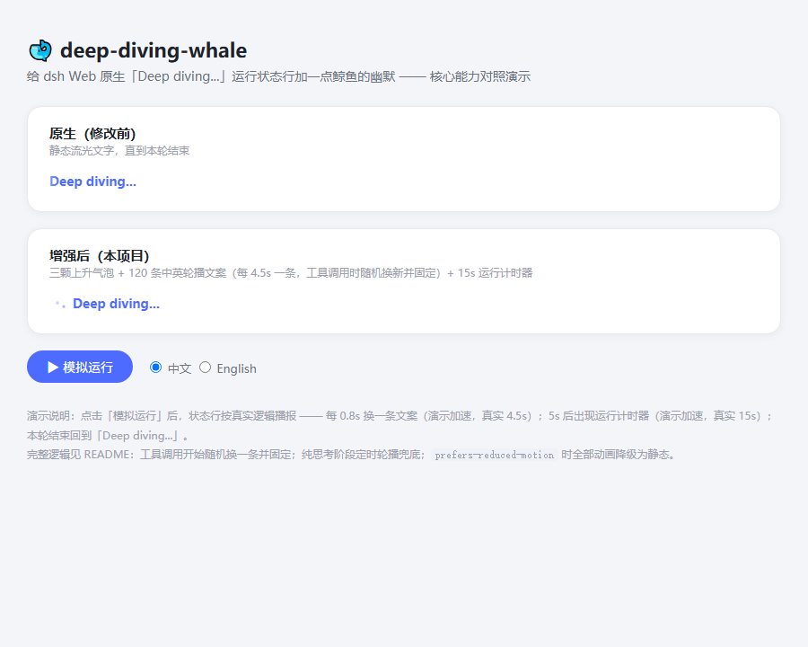
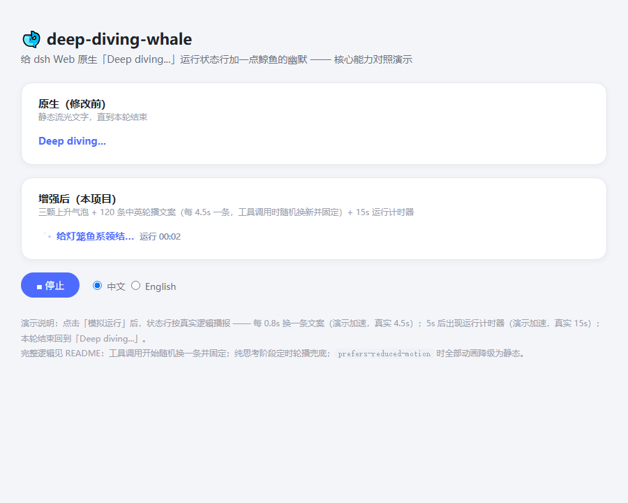

# whale-whisper 🐋 (且听鲸吟)

[中文](README.md)

Adds whale-themed rotating captions and rising bubbles to the native "Deep diving..." status line in the DeepSeek Harness web UI.

| Stock | Enhanced |
|---|---|
|  |  |

🎬 Open [`docs/demo.html`](docs/demo.html) in a browser for a side-by-side demo.

## What you get

- 🫧 Three rising bubbles animation
- 🐋 120 Chinese + 120 English playful captions ("Tying the lanternfish's bowtie...", "Walking the electric eel..."), rotating every 4.5s
- 🌐 Follows the UI locale automatically (zh/en)
- ⏱ Keeps the native elapsed-time clock (shown after 15s)
- ♿ Honors `prefers-reduced-motion` and announces via `aria-live`

## Install

```bash
dsh plugin --profile web add git@github.com:z331281772/whale-whisper.git
```

Restart `dsh web` and refresh the page. Built for dsh `0.1.0-rc.6`.

## Uninstall

```bash
dsh plugin --profile web remove whale-whisper
```

To restore the stock status line, the plugin keeps a backup of the original bundle after the first patch:

```bash
B=~/.dsh/profiles/node_modules/@deepseek-ai/dsh-client-ui-conversation/lib/client.js
cp "$B.whale-whisper.bak" "$B"
```

Or reinstall the `@deepseek-ai/dsh-client-ui-conversation` package.

## Custom captions

Edit `captions.json` (two arrays, `zh` and `en`, any length), reinstall the ui-conversation package, and restart `dsh web`.

## License

[MIT](LICENSE)
